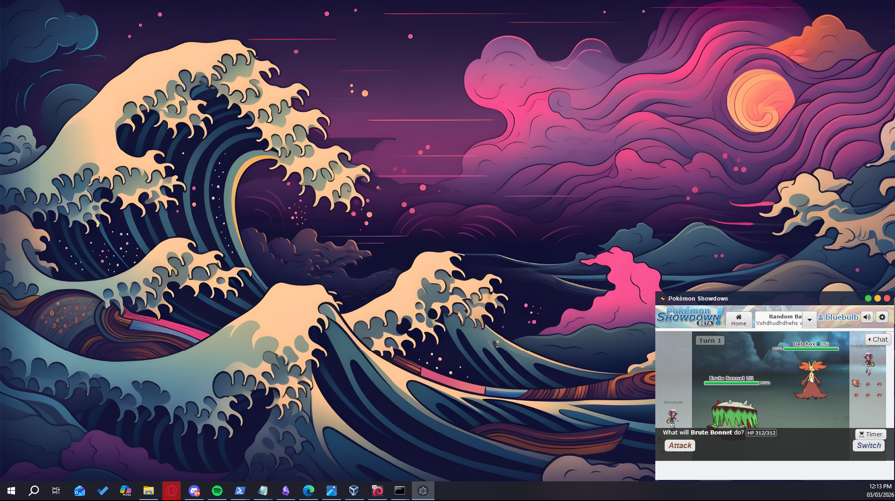

# Pokémon Showdown — Floating Desktop App

A tiny, always-on-top Electron window that loads [Pokémon Showdown](https://play.pokemonshowdown.com) in the bottom-right corner of your screen — and fades to 80% transparent when your mouse leaves it.

---

## Preview



---

## Folder structure

```
pokemon-showdown-app/
├── main.js        # Electron main process
├── preload.js     # Secure bridge between renderer and main
├── index.html     # App UI (custom title bar + webview)
├── package.json
└── README.md
```

---

## Prerequisites

| Tool | Version | Download |
|------|---------|----------|
| Node.js | 18 LTS or later | https://nodejs.org |
| npm | bundled with Node.js | — |

Electron itself is installed automatically as a dev dependency.

---

## Quick start

```bash
# 1. Enter the project folder
cd pokemon-showdown-app

# 2. Install dependencies (downloads Electron ~100 MB first run)
npm install

# 3. Launch the app
npm start
```

The app window will appear in the **bottom-right corner** of your primary display.

---

## Window controls (custom title bar)

| Button | Action |
|--------|-------|
| 🟢 Green | Reload the Showdown page |
| 🟡 Yellow | Minimise to taskbar/dock |
| 🔴 Red | Close the app |

Drag the dark title bar to reposition the window anywhere on screen.

---

## Configuration

All options live at the top of `main.js`:

```js
const winWidth  = 400;   // default window width  (px)
const winHeight = 600;   // default window height (px)
const margin    = 16;    // gap from screen edge   (px)
```

Change these values and restart the app to apply.

---

## Cross-platform notes

- **Windows / Linux** — `frame: false` hides the OS title bar; the custom bar in `index.html` takes over.
- **macOS** — `titleBarStyle: 'hidden'` hides the bar but keeps the native traffic-light buttons hidden behind the custom ones.

The app runs on all three platforms with no code changes.
